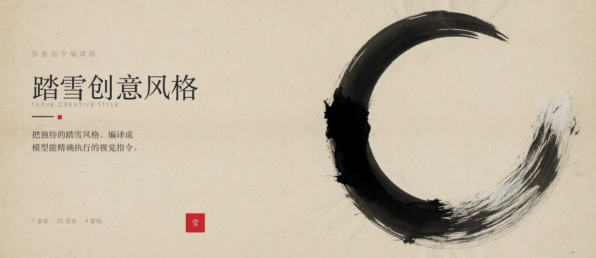
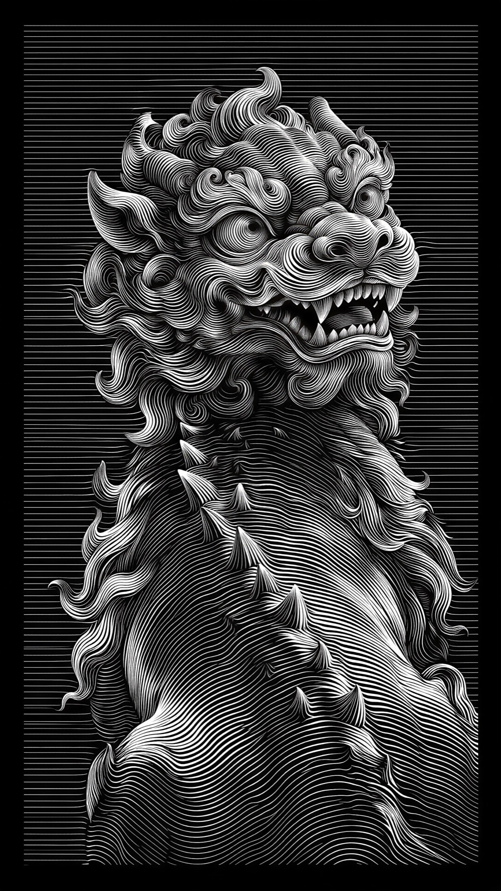
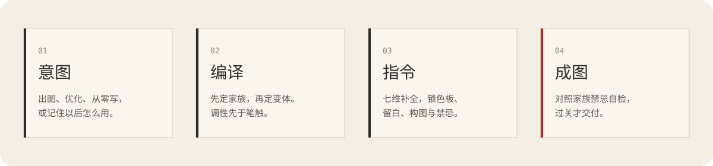
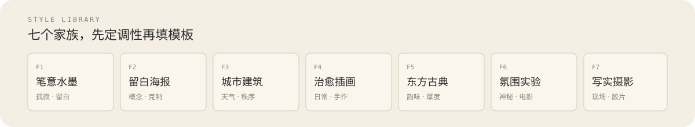

<p align="center">
  
</p>

# 踏雪创意风格

把独特的「踏雪风格」变成模型能精确执行的视觉指令。

<p align="center">
  
  
  
</p>
<p align="center">
  
  
  
</p>

## 四种能力

**风格出图**　「用踏雪风格画一张深夜书房」

从 7 家族 32 变体里选定风格，输出完整提示词并出图。

**提示词优化**　「优化这段提示词」

七维诊断打分，按缺补缺，注入踏雪 DNA，逐条说明改了什么。

**元提示词创作**　「写个提示词：有夏天感觉的图」

先重定义需求，再写成可换主题复用的视觉指令。

**学习记忆**　「以后都用水墨 3:4」

记下偏好，下次路由优先匹配。

风格库覆盖文人水墨、留白海报、城市卡、治愈插画、上美影、剪纸、纸雕、日式杂志、写实胶片、CCD、影棚人像。

## 怎么工作

<p align="center">
  
</p>

它是影像指令编译器。输入是意图，输出是模型能执行的视觉指令。质量取决于四件事：意图识别是否准、风格模板是否准、参数是否锁死、出图后有没有对照禁忌检查。

## 开始使用

```bash
npx skills add taxueseek/taxue-creative-style
```

装好后直接说上面任何一句。

## 七个家族

<p align="center">
  
</p>

- **F1 笔意水墨**　孤寂人物、水墨、宋画、飞天。默认竖 3:4
- **F2 留白海报**　节日、概念、书法、隐喻。默认竖 3:4
- **F3 城市建筑**　城市卡、纸雕大场景。默认横 4:3
- **F4 治愈插画**　日常小物、动物、温馨场景。默认方 1:1
- **F5 东方古典**　仕女、剪纸、复古杂志、仙侠。默认竖 3:4
- **F6 氛围实验**　黑暗行者、符号雕塑。默认竖 3:4
- **F7 写实摄影**　纪实、胶片、CCD、影棚。比例按变体

只说「踏雪风格」、没有指定时，默认走 F1 文人水墨。实验变体要点名才用。

## 核心方法

- **留白第一**：大面积空白是构图主体，不是空缺
- **克制**：少即是多，宁意犹未尽，不一览无余
- **文字即设计**：中文字是视觉元素，不是附属说明
- **纸感优先**：宣纸肌理、印刷颗粒优于数字光泽
- **概念深度**：捕捉本质，不图解表面
- **色彩纪律**：受限色板，单一强调色常常已经足够

## 学习记忆

每次出图后，会记下变体、比例和反馈，下次优先按你的偏好走。个性化内容只留在你本机：

- `memory/user-preferences.md` 只记偏好，不记出图内容，不提交
- `references/prompt-archive.md` 是本地版本归档，每次交付自动追加
- 仓库已忽略 `memory/` 和测试文件

<details>
<summary>目录结构</summary>

```
taxue-creative-style/
├── SKILL.md
├── gallery/
├── assets/readme/
├── references/
└── memory/
```

</details>

## License

MIT
