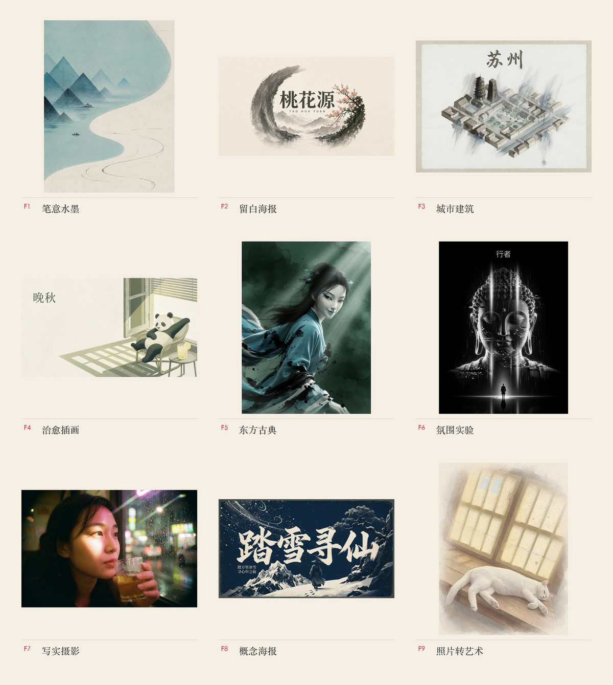
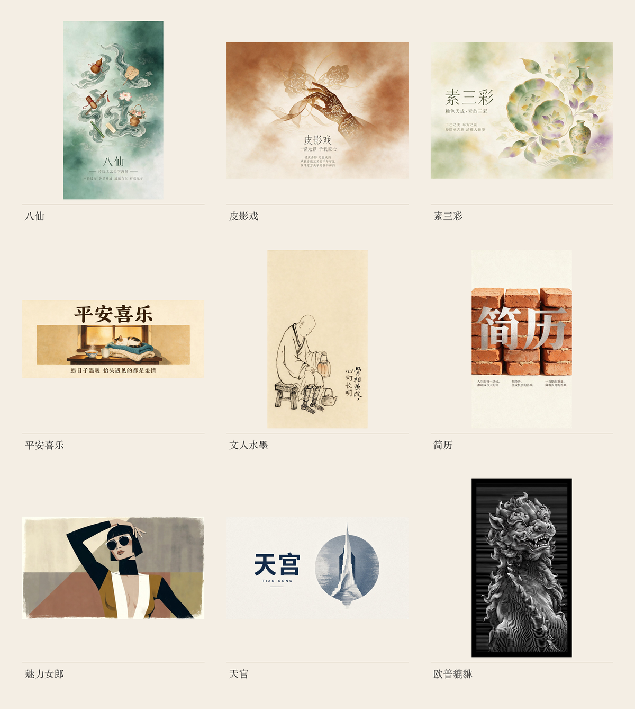

<p align="center">


</p>

<p align="center">
  <a href="#成图标本">成图</a> ·
  <a href="./gallery/README.md">原图</a> ·
  <a href="#四种能力">能力</a> ·
  <a href="#九个家族">家族</a> ·
  <a href="#怎么工作">怎么工作</a> ·
  <a href="#开始使用">开始使用</a>
</p>

# 踏雪创意风格

你说想画什么，它写成模型能听懂的视觉指令。

## 成图标本

九个家族，各一张经典成图。点家族编号看原图。



<p align="center">
<a href="./gallery/f1-ink.jpg">F1</a> ·
<a href="./gallery/f2-blank.jpg">F2</a> ·
<a href="./gallery/f3-city.jpg">F3</a> ·
<a href="./gallery/f4-healing.jpg">F4</a> ·
<a href="./gallery/f5-oriental.jpg">F5</a> ·
<a href="./gallery/f6-atmosphere.jpg">F6</a> ·
<a href="./gallery/f7-photo.jpg">F7</a> ·
<a href="./gallery/f8-concept.jpg">F8</a> ·
<a href="./gallery/f9-photo-art.jpg">F9</a>
·
<a href="./gallery/README.md">全部原图</a>
</p>

家族格子之外，还有这些成图。点图看原图。



<p align="center">
<a href="./gallery/more/baxian.jpg">八仙</a> ·
<a href="./gallery/more/piying.jpg">皮影戏</a> ·
<a href="./gallery/more/sucancai.jpg">素三彩</a> ·
<a href="./gallery/more/pingan.jpg">平安喜乐</a> ·
<a href="./gallery/more/wenren.jpg">文人水墨</a> ·
<a href="./gallery/more/jianli.jpg">简历</a> ·
<a href="./gallery/more/meili.jpg">魅力女郎</a> ·
<a href="./gallery/more/tiangong.jpg">天宫</a> ·
<a href="./gallery/more/pixiu.jpg">欧普貔貅</a>
</p>

## 四种能力

**按风格出图**　「用水墨画一张深夜书房」

从九个家族里选对调性，写成完整提示词，再出图。

**改已有提示词**　「优化这段提示词」

看它缺什么，补什么，改完逐条告诉你动了哪一句。

**从零写提示词**　「写个提示词：有夏天感觉的图」

一句话也能写成可换主题、可直接出图的指令。

**记住你的偏好**　「以后都用水墨 3:4」

记下常用风格和比例，下次按你的习惯走。

要封面或头图时，先选家族，再按封面规矩留字、留边，不是另开一套。

## 九个家族

上面九宫格就是九个家族的样子。先定家族，再定具体变体。不知道选哪个，直接说用途也行。

- **F1 笔意水墨**　安静的人、猫、宋画、水墨。默认竖图。
- **F2 留白海报**　节日、书法、概念海报、欧普线描。默认竖图。
- **F3 城市建筑**　城市卡、纸雕大场景。默认横图。
- **F4 治愈插画**　日常小物、动物、绘本手账。默认方图。
- **F5 东方古典**　仕女、剪纸、复古杂志、仙侠。默认竖图。
- **F6 氛围实验**　黑暗、符号、电影感。默认竖图。
- **F7 写实摄影**　纪实、胶片、早期手机快照、影棚、运动。比例按主题定。
- **F8 概念海报**　把一个字、一个词做成展览感海报。默认超宽横图。
- **F9 照片转艺术**　手里已有照片，转成手绘、记忆面板、涂鸦、动画或皮影。默认竖图。

没指定风格时，按你以前的偏好走；第一次用，走文人水墨。实验风格要点名才用。

想做手机壁纸、公众号头图、节气海报、专辑封面、品牌主视觉、城市卡，直接说用途，它会帮你选家族和比例。

## 还能接着做

碰到下面这些，不硬套九个家族，会转到对应专项：

- 固定一个卡通形象，每张图都是同一个人
- 民国月份牌、老上海复古杂志
- 一张图变成很多风格或视角
- 已有照片，反推两份提示词：一份尽量像原图，一份按踏雪风格重写
- 正宗国画、雕塑、脸谱、工艺美术

## 怎么工作

<p align="center">
  
</p>

输入是你的意图，输出是模型能执行的视觉指令。图好不好，取决于四件事：有没有听清你要什么、风格模板准不准、比例和颜色有没有锁死、出图后有没有对照禁忌检查。

所有风格都守这几条：留白是构图主体，不是空着；少即是多；中文字是画面的一部分；纸感优先于数字光泽；颜色要克制。

## 开始使用

```bash
npx skills add taxueseek/taxue-creative-style
```

装好后直接说上面任何一句。

## 学习记忆

每次出图后，会记下风格、比例和你的反馈。个性化内容只留在你本机：

- `memory/user-preferences.md` 只记偏好，不记出图内容，不提交
- 版本归档、素材索引留在本地，不随技能分发
- 仓库已忽略 `memory/` 和测试文件

## License

MIT
